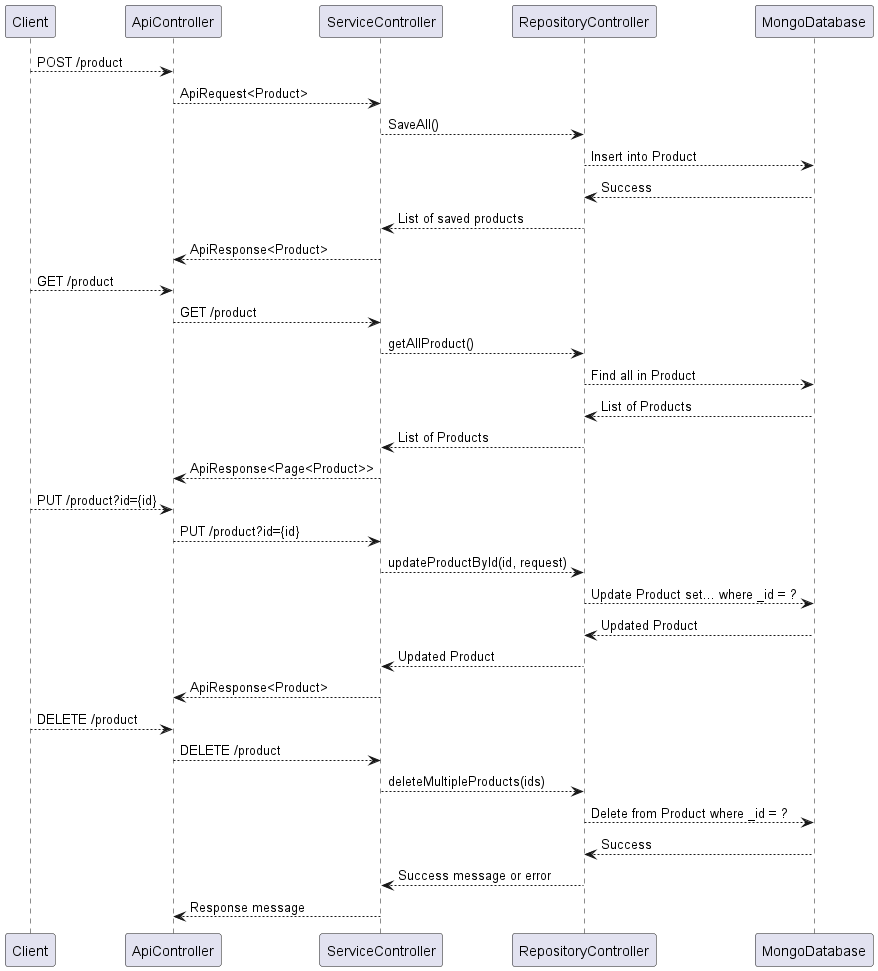

# Spring Boot Application of  Product Management with MongoDB CRUD Operations

## Overview
This is a Spring Boot application for product management, utilizing MongoDB for data storage. The application supports basic CRUD (Create, Read, Update, Delete) operations for managing product information.

## Sequence Diagram

## Technologies Used
- **Spring Boot:** Framework for creating Java-based, production-grade Spring-based applications.
- **MongoDB:** A NoSQL database for storing product data.
- **Spring Security:** Provides authentication and access control.
- **Postman:** API development and testing tool for interacting with the Spring Boot application.

## Project Structure
- **Controller:** Handles incoming HTTP requests, manages product-related endpoints.
- **Service:** Contains business logic for product operations.
- **Entity:** Represents the product entity.

## Controller

### 1. Create Product
**Endpoint:** `POST /product`
- **Description:** Creates one or more products.
- **Access:** Requires USER role.
- **Request Body:** List of products.
- **Response:** ApiResponse containing the saved products.

### 2. Update Product
**Endpoint:** `PUT /product`
- **Description:** Updates product details by ID.
- **Request Parameters:** `id` - Product ID to update.
- **Request Body:** Product details to update.
- **Response:** ApiResponse containing the updated product.

### 3. Delete Products
**Endpoint:** `DELETE /product`
- **Description:** Deletes multiple products by their IDs.
- **Request Body:** List of product IDs to delete.
- **Response:** Success message or an error message.

### 4. Get All Products
**Endpoint:** `GET /product`
- **Description:** Retrieves a paginated list of products with optional filters and sorting.
- **Request Parameters:**
  - `filters` - Optional filters for product attributes.
  - `page` - Page number.
  - `size` - Number of items per page.
  - `sortBy` - Attribute to sort by.
  - `sortDirection` - Sorting direction (asc/desc).
- **Response:** ApiResponse containing a paginated list of products.

## Security
- **Endpoint Security:** The `/product` endpoints require the USER role for access.

## Logging
- **Logger:** SLF4J is used for logging. Logs are generated for errors and other relevant events.

## Exception Handling
- **Error Handling:** Custom error messages are provided for different scenarios.

## How to Run
1. **Configure MongoDB Connection:**
  - Open `src/main/resources/application.properties`.
  - Update the MongoDB connection properties based on your MongoDB server configuration.

2. **Build and Run the Spring Boot Application:**
  - Run that application using the the IDE `Intelij idea`
3. **Access the API Using Postman:**
  - Open [Postman](https://www.postman.com/) or download and install it if you haven't.
  - Use the following endpoints to interact with the API:
    - **Create Product (POST):**
      - Endpoint: `http://localhost:8081/product`
      - Method: `POST`
      - Headers:
        - `Content-Type: application/json`
        - `Authorization: Basic Auth`
      - Body: JSON array of products.

    - **Update Product (PUT):**
      - Endpoint: `http://localhost:8081/product?id=PRODUCT_ID`
      - Method: `PUT`
      - Headers:
        - `Content-Type: application/json`
        - `Authorization: Basic Auth`
      - Body: JSON object with updated product details.

    - **Delete Products (DELETE):**
      - Endpoint: `http://localhost:8081/product`
      - Method: `DELETE`
      - Headers:
        - `Content-Type: application/json`
        - `Authorization: Basic Auth`
      - Body: JSON array of product IDs to delete.

    - **Get All Products (GET):**
      - Endpoint: `http://localhost:8081/product`
      - Method: `GET`
      - Headers:
        - `Authorization: Basic Auth`
      - Query Parameters (Optional):
        - `filters`: JSON object for optional filters.
        - `page`: Page number.
        - `size`: Number of items per page.
        - `sortBy`: Attribute to sort by.
        - `sortDirection`: Sorting direction (asc/desc).

  

